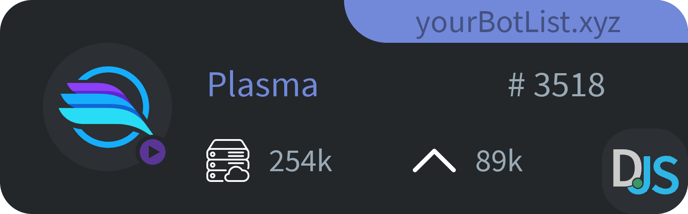

[](https://www.npmjs.com/package/discbotwid)
[](https://www.npmjs.com/package/discbotwid)
[](https://www.npmjs.com/package/discbotwid)
[](https://www.npmjs.com/package/discbotwid)


<br>

#  Discord Bot Card
Simple easy-to-use Bot Card generator that generates a Card displaying all the important details you need.

<br>

## Features
* ⛩️ Small / Long / Big Card Design
* 🍭 Status Indicator
* 🖼️ Modern Design
* 📎  Show Votes and Guild Count
* 🗛 Show your Botlist


<br>

## Examples
<details open> 
    <summary> Long Bot Card </summary>

```javascript
const Discord = require("discord.js");
const { welcomeImage } = require('discordwl');
const client = new Discord.Client({
    intents: [ Discord.Intents.FLAGS.GUILDS ]
});

client.on("messageCreate", async message => {
    if(message.author.bot) return
    
    let card = await generateCard('long', {
        name: 'Plasma',
        tag: '3518',
        description: 'Easy to setup • Reliable • FREE! - create a giveaway in your server, manage peoples invites, and use our FREE levelling system!',
        status: 'streaming',
        guilds: 254434,
        votes: 89123,
        library: 'discord.js',
        botList: 'yourBotList.xyz'
    })

    message.channel.send({ files: [ card.toBuffer('image/png') ]})
});

client.login('Your-Bot-Token');
```
    



</details>